# ONE PLACE - A Habit Tracking Application
## IU Mobile Software Engineering Project

This repository contains a habit tracking mobile application developed as part of the course Mobile Software Engineering II at IU International University of Applied Sciences.
The project was created for academic purposes and demonstrates the practical application of mobile software engineering concepts, including application architecture, state management, backend integration, authentication, testing, and continuous integration.

The goal of the application is to support users in building and maintaining positive habits. interact with the app by defining individual habits, checking off habits on a daily basis, and review ingtheir progress using graphical visualizations and statistics. They can configure their personal preferences in their profile. Focus was on simplicity and clarity of use and long-term progress visibility. It was created following the <a href="https://m3.material.io" target="_blank">Google Material Design Principles. </a>

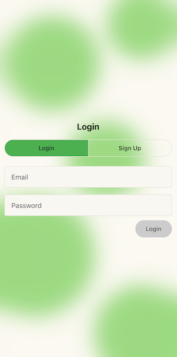
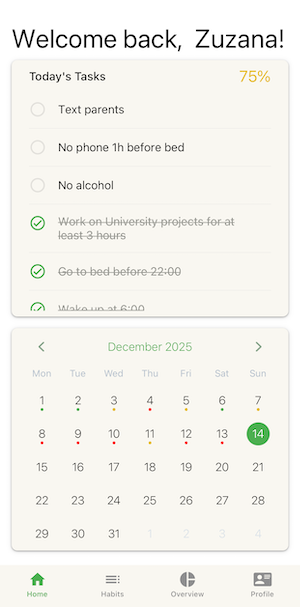
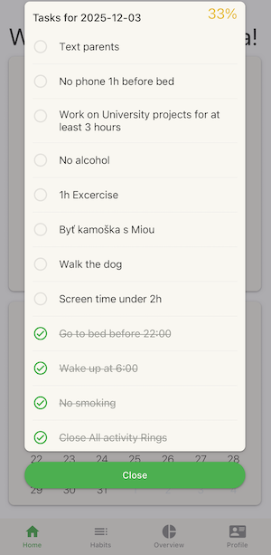
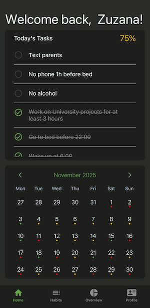
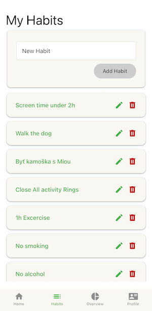
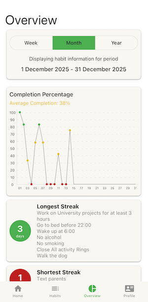
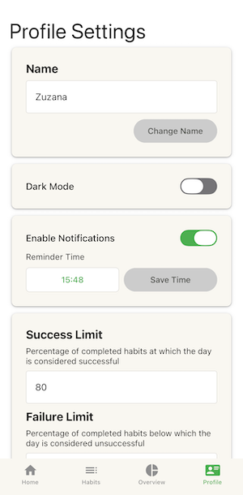

## Application components

The application is built using React Native with Expo and follows a client–server architecture.
The frontend provides the user interface, navigation, and visualizations (e.g. habit checklists, calendars, and charts). Local and backend communication is handled through a centralized API layer using Axios. A Node.js / Express backend exposes a REST API for user authentication and habit data management. Habit data is stored in a relational database managed via Prisma ORM.
Automated tests and a CI workflow ensure build reproducibility and software quality, focusing on Android environment as subject required an Android application. However, iOS executable can also be created manually.

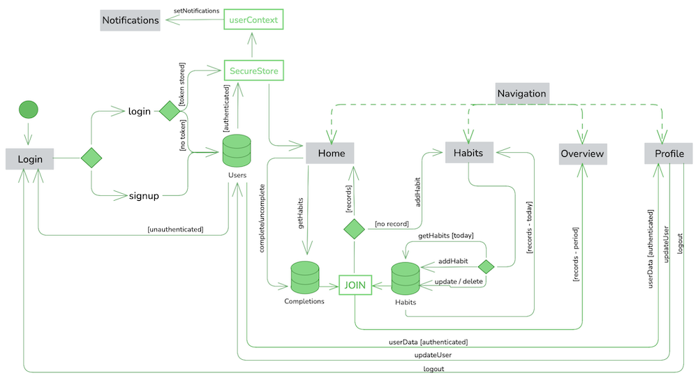
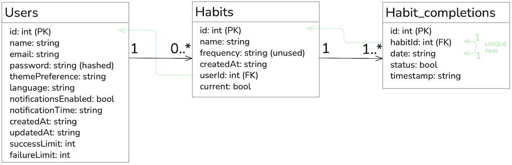
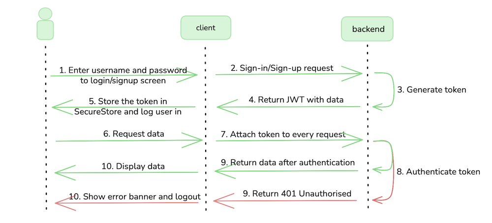

## Execution

### Backend

Backend is a containerized application with all of its dependencies. It can be started with the provided docker compose file, or via npm for development or testing.

##### Sample database

Sample database file is provided to be used by the backend. If no filename is provided in the environment variables, the sample file `/prisma/dev.db` is used by default. 
Sample user data exists in the sample file to browse and edit existing habits and see overview over time. 

- `email: zuzka@gmail.com`
- `password: abcdef`

##### Running the containerized application

1. Navigate to the backend/ directory
   `cd backend`

2. Provide a .env file with following values. If the file or specific environment variable is not created, default value defined in docker-compose.yml will be used. 
- `DATABASE_URL (optional)`: database file
- `JWT_SECRET (optional)`: secret to sign JWT tokens
- `JWT_EXPIRES_IN (optional)`: timeframe for keeping the JWT token valid, eg. 30d

3. Build and run the backend container
   `docker compose up --build`

##### Running via npm
1. Navigate to the backend/ directory
   `cd backend`

2. Provide a .env file with following values. If the file or specific environment variable is not created, default value defined in docker-compose.yml will be used. 
- `DATABASE_URL (optional)`: database file
- `JWT_SECRET (optional)`: secret to sign JWT tokens
- `JWT_EXPIRES_IN (optional)`: timeframe for keeping the JWT token valid, eg. 30d

3. Start locally
   `npm start `

### Mobile Application

The application must be built for the desired environment (android/ios). There is a GitHub Actions workflow provided for Android build which results in a working .apk executable. This was created to avoid platform incompatibilities, installing and configuring required build tools and system packages, and to avoid dependency constraints (known also as dependency hell, which was the reason I resorted to this option). If you wish, you can try to execute the steps in the workflow manually on your device (from personal experience, don't). The created executable (via the provided workflow or built manually) can be copied to the device and executed. The application can also be simply started via the Expo Go app, used especially during development and testing.

##### Build Android executable with provided workflow

1. Fork or clone the repository. 
   `git clone https://github.com/zuzanapiarova/IU-mobile-app.git`

2. The mobile application is online-only, meaning the backend must run and its IP must be provided to the built executable. Otherwise user login will fail, making the application unusable.
Provide the backend IP to the workflow as an environment secret in Repository Settings --> Security --> Secrets and variables --> Actions --> New Repository Secret
- `EXPO_PUBLIC_API_URL`: the LAN IP on which the backend is running, eg. 192.168.01.02

3. On push to the repository a build workflow is triggered. 

4. Initial build takes around 10 minutes. 

5. The executable can be found in the Artifacts section of the specific workflow run.

6. Copy it to the device and run. Ensure the mobile device is connected to the same LAN as the device on which the backend is running.

##### Use the Expo Go App

1. Download the Expo GO application on a mobile device (iOS/Android)

2. Ensure the mobile device is connected to the same LAN as the devic on which the backend runs.

3. Run `npm start`

4. Scan the generated QR code and use the app

## Tests

Test are available for the frontend components and files making calls to the backend, and the backend server endpoints. They are included in the workflow file so it is ensured the resulting executable is tested. They can also be called manually by:

#### Frontend tests

`cd frotend`
`npm run test`

#### Backend tests

`cd backend`
`npm run test`

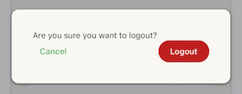